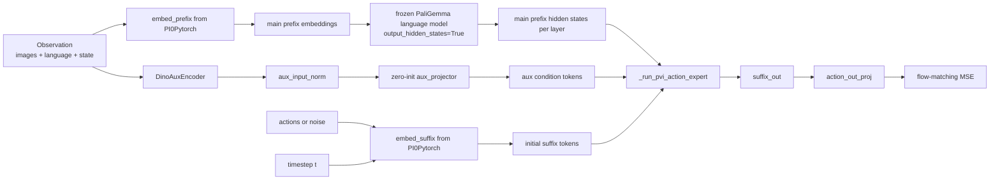
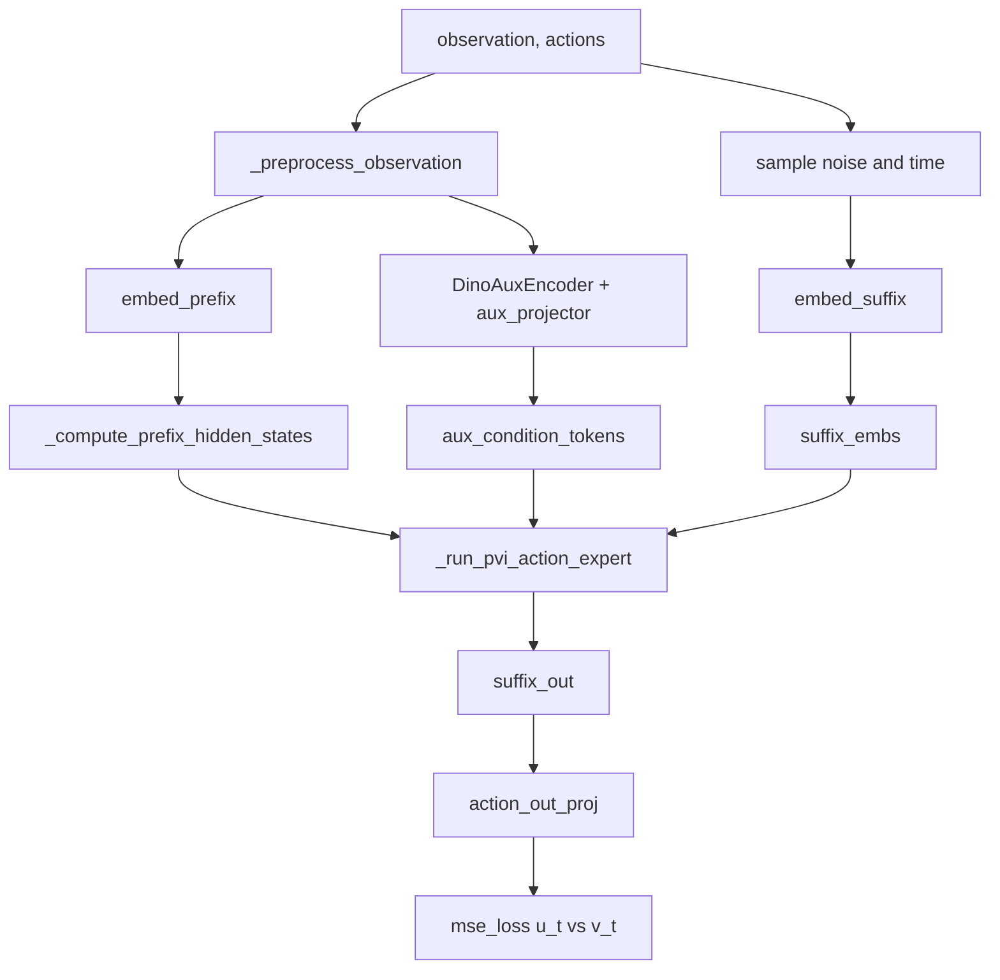

# PVI PyTorch Architecture Notes

This document explains the current PyTorch PVI implementation centered on
[`src/openpi/models_pytorch/pi0_pvi_pytorch.py`](src/openpi/models_pytorch/pi0_pvi_pytorch.py).
It is written against the code currently in this workspace, not against the paper in the abstract.

## Quick Start

### Convert JAX checkpoints to PyTorch

```bash
# pi0_base
uv run examples/convert_jax_model_to_pytorch.py \
    --checkpoint_dir gs://openpi-assets/checkpoints/pi0_base \
    --config_name pi0_libero \
    --output_path ./checkpoints/pytorch/pi0_base
```

```bash
# pi05_base
uv run examples/convert_jax_model_to_pytorch.py \
    --checkpoint_dir gs://openpi-assets/checkpoints/pi05_base \
    --config_name pi05_libero \
    --output_path ./checkpoints/pytorch/pi05_base
```

### Train PVI on LIBERO

```bash
# pi0 + PVI
CUDA_VISIBLE_DEVICES=0 HF_LEROBOT_HOME=/data/jhshin/openpi/datasets \
  uv run scripts/train_pytorch_PVI.py pi0_libero_pvi \
    --exp_name pi0_libero_pvi \
    --pytorch_weight_path ./checkpoints/pytorch/pi0_base
```

```bash
# pi05 + PVI
CUDA_VISIBLE_DEVICES=0 HF_LEROBOT_HOME=/data/jhshin/openpi/datasets \
  uv run scripts/train_pytorch_PVI.py pi05_libero_pvi \
    --exp_name pi05_libero_pvi \
    --pytorch_weight_path ./checkpoints/pytorch/pi05_base
```

## File Map

- `src/openpi/models_pytorch/pi0_pvi_pytorch.py`
  PVI model definition. Inherits from `PI0Pytorch` and replaces only the suffix expert execution path.
- `src/openpi/models_pytorch/pvi_modules.py`
  Auxiliary DINO encoder and zero-init layers used by PVI.
- `src/openpi/models_pytorch/pi0_pytorch.py`
  Baseline PI0 / PI0.5 PyTorch implementation that provides preprocessing, prefix embedding, suffix embedding,
  noise/time sampling, and the final action head.
- `scripts/train_pytorch_PVI.py`
  Training entrypoint that preserves PVI config fields and loads base checkpoints with PVI-aware initialization.

## What This Implementation Actually Does

The current implementation keeps the original PI0 / PI0.5 prefix pipeline intact and replaces the baseline
"single action-expert suffix pass" with a dual-path suffix computation:

1. A frozen main branch conditions on the original VLM prefix.
2. A trainable copy branch conditions on DINO-derived auxiliary visual tokens.
3. At every expert layer, the copy branch produces a residual control signal that is injected into the main branch.

The result is still a single suffix output used by the same flow-matching loss as baseline PI0.

## High-Level Diagram



## Trainable vs Frozen Parts

### Frozen

- `paligemma_with_expert`
  The pretrained VLM prefix path and the pretrained main action expert are frozen.
- `aux_encoder`
  The DINO auxiliary encoder is frozen.

### Trainable

- `aux_input_norm`
- `aux_projector`
- `copy_expert`
- `copy_conditioners`
- `injectors`
- Inherited PI0 heads and adapters:
  `action_in_proj`, `action_out_proj`, and either:
  `state_proj` + `action_time_mlp_*` for PI0,
  or `time_mlp_*` for PI0.5

This matters because PVI here is not "only train the new branch". The original action heads and suffix embeddings
from `PI0Pytorch` are still trainable.

## Support Modules in `pvi_modules.py`

### `ZeroInitLinear`

- A linear layer whose weight and bias are initialized to zero.
- Used for the auxiliary projector and for each layer-wise injector.
- Practical effect:
  at initialization, the auxiliary branch does not perturb the frozen main branch output.

### `DinoAuxEncoder`

- Loads `facebook/dinov2-giant` via Hugging Face `AutoModel`.
- Freezes all parameters.
- Converts input images to channels-first `float32`.
- Resizes to `224 x 224` if needed.
- Converts image range into `[0, 1]` and applies ImageNet normalization.
- Removes the CLS token and returns patch tokens only.

Returned tensor shape:

```text
aux_features: [B, V * P, d_dino]
patches_per_view: P
```

Where:

- `B` = batch size
- `V` = number of camera views
- `P` = number of patch tokens per view
- `d_dino` = DINO hidden size

## Class Structure: `PI0PVI`

`PI0PVI` extends `PI0Pytorch`. It reuses:

- `_preprocess_observation`
- `sample_noise`
- `sample_time`
- `embed_prefix`
- `embed_suffix`
- `_prepare_attention_masks_4d`
- final `action_out_proj`

What changes is how suffix tokens are processed after embedding.

### Constructor

`__init__` first builds the baseline PI0 model and then adds PVI modules:

- `aux_encoder`
  Frozen DINO feature extractor.
- `aux_input_norm`
  Trainable normalization before projection.
- `aux_projector`
  Zero-init projection from DINO hidden size to the PaliGemma text hidden size.
- `copy_expert`
  A deep copy of the pretrained main action expert.
- `copy_conditioners`
  Per-layer conditioning modules that mimic the VLM prefix layer interface:
  `input_layernorm`, `k_proj`, `v_proj`.
- `injectors`
  One zero-init linear layer per expert layer.

### Precision Policy

The current code sets:

- main pretrained branch precision from `config.dtype`
- PVI copy branch precision from `config.dtype`

So if training precision is `bfloat16`, both `copy_expert` and `copy_conditioners` are created in `bfloat16`.
If training precision is `float32`, they stay in `float32`.

### Train / Eval Behavior

`train()` calls `super().train(mode)` and then forces:

- `paligemma_with_expert.eval()`
- `aux_encoder.eval()`

This keeps the frozen backbone modules in eval mode even during training.

### Gradient Checkpointing Behavior

`gradient_checkpointing_enable()` does this:

1. Calls the baseline method.
2. Immediately turns checkpointing back off for:
   - PaliGemma language model
   - vision tower
   - frozen main expert
3. Leaves checkpointing enabled only on `copy_expert` if the module supports the flag.

Implementation note:
the custom PVI suffix path manually executes layers instead of calling a single model forward.
That means the baseline `_apply_checkpoint(...)` wrapper is not applied around the whole dual-path suffix stack,
so checkpointing savings are weaker than in baseline `PI0Pytorch`.

## Initialization From a Base Checkpoint

When `scripts/train_pytorch_PVI.py` loads a base PyTorch checkpoint:

1. It calls `create_model(model_cfg)` so that `use_pvi=True` returns `PI0PVI`.
2. It loads the base checkpoint with `strict=False`.
3. It checks that any missing keys are only PVI-specific keys.
4. It calls `initialize_pvi_from_main_expert()`.

That method:

- copies `main_expert` weights into `copy_expert`
- copies each frozen prefix layer's `input_layernorm`, `k_proj`, `v_proj` into the matching `copy_conditioner`
- resets `aux_projector` to zeros
- resets every injector to zeros

So the copy branch starts from the pretrained prior, while the new fusion interfaces start from zero.

## Core Data Structures

### Prefix Path

From inherited `embed_prefix(...)`:

```text
prefix_embs:      [B, prefix_len, d_prefix]
prefix_pad_masks: [B, prefix_len]
prefix_att_masks: [B, prefix_len]
```

The prefix contains:

- image tokens from the frozen vision tower
- language token embeddings

The prefix attention mask is non-causal inside the prefix. Image and language tokens attend to each other freely.

### Suffix Path

From inherited `embed_suffix(...)`:

```text
suffix_embs:      [B, suffix_len, d_suffix]
suffix_pad_masks: [B, suffix_len]
suffix_att_masks: [B, suffix_len]
adarms_cond:      None or [B, d_suffix]
```

Suffix contents differ slightly by model:

- PI0:
  one state token followed by action tokens, so `suffix_len = 1 + action_horizon`
- PI0.5:
  action tokens only, so `suffix_len = action_horizon`

Attention semantics from `embed_suffix(...)`:

- the first suffix token starts a causal region
- later action tokens attend causally within the suffix
- suffix tokens can attend to the prefix
- prefix tokens do not attend back into the suffix

### Auxiliary Path

From `_embed_auxiliary_prefix(...)`:

```text
aux_condition_tokens: [B, aux_prefix_len, d_prefix]
aux_pad_masks:        [B, aux_prefix_len]
aux_att_masks:        [B, aux_prefix_len]
```

Where:

- `aux_prefix_len = V * P`
- `d_prefix` is the PaliGemma text hidden size

Important implementation detail:
the auxiliary tokens are projected into the prefix hidden size, not the action-expert hidden size.
That is because they are consumed through copied prefix-style `k_proj` and `v_proj` modules.

## End-to-End Forward Pass

### Training Forward



### Step-by-Step

1. Preprocess observation into:
   images, image masks, language tokens, language masks, and state.
2. Sample flow-matching noise and time if not provided.
3. Build noisy actions:

```text
x_t = t * noise + (1 - t) * actions
u_t = noise - actions
```

4. Use the inherited `embed_prefix(...)` to build the original image+language prefix.
5. Use the inherited `embed_suffix(...)` to build the state/action/timestep suffix.
6. Run `_compute_pvi_suffix_output(...)` instead of the baseline single expert forward.
7. Slice the last `action_horizon` suffix positions.
8. Project with `action_out_proj`.
9. Compute flow-matching MSE.

## How `_compute_pvi_suffix_output(...)` Works

This method assembles all inputs required by the custom dual-path suffix stack.

### 1. Main Prefix Hidden States

`_compute_prefix_hidden_states(...)` runs only the frozen PaliGemma language model on the prefix and requests
`output_hidden_states=True`.

Why this matters:

- the main branch does not use the full VLM forward during suffix computation
- instead, each suffix layer directly reads the per-layer prefix hidden state it should condition on

The call is usually wrapped in `torch.no_grad()`.

Implementation detail:
it uses a boolean 4D attention mask here to preserve the more memory-efficient attention path inside the HF model.

### 2. Auxiliary Conditioning Tokens

`_embed_auxiliary_prefix(...)`:

1. extracts DINO patch tokens
2. applies `aux_input_norm`
3. projects with `aux_projector`
4. expands image masks from per-view masks to per-patch masks
5. creates a non-causal auxiliary attention mask

These tokens are not sent through a separate transformer stack.
They stay as raw projected auxiliary tokens and are converted to K/V states layer-by-layer by `copy_conditioners`.

### 3. Main and Auxiliary Suffix Attention Masks

`_prepare_suffix_attention(...)` is called twice:

- once for main branch prefix masks
- once for auxiliary branch prefix masks

For each branch it returns:

- a 4D additive attention mask
- prefix position ids
- suffix position ids

This is necessary because the main branch conditions on the original prefix length, while the copy branch conditions
on the auxiliary prefix length.

## Conditioning Interface

The function `_get_conditioning_modules(...)` makes the rest of the code agnostic to the source of conditioning.
It supports two cases:

- a real frozen PaliGemma prefix layer
- a `ModuleDict` from `copy_conditioners`

Both expose the same logical interface:

- `input_layernorm`
- `k_proj`
- `v_proj`

That shared interface is what lets the same `_suffix_layer_forward(...)` code run both branches.

## Condition K/V Construction

`_compute_condition_key_value_states(...)` does the exact conditioning-token to K/V conversion:

1. pick `input_layernorm`, `k_proj`, `v_proj`
2. cast the conditioning tokens to the conditioner weight dtype if needed
3. normalize tokens
4. project into keys and values
5. reshape into `[B, n_kv_heads, seq, head_dim]`
6. cast to target dtype if needed
7. apply rotary embeddings to the keys

For the main branch:

- `condition_tokens = main_prefix_hidden_states[layer_idx]`
- `condition_provider = frozen prefix layer layer_idx`

For the copy branch:

- `condition_tokens = aux_condition_tokens`
- `condition_provider = copy_conditioners[layer_idx]`

## Per-Layer Dual-Path Update

```mermaid
flowchart TB
    MP[main prefix hidden state for layer l] --> MKV[main conditioner to K/V]
    AP[aux condition tokens] --> CKV[copy_conditioner l to K/V]

    MS[main suffix hidden states h_main^l] --> ML[main expert layer l]
    CS[copy suffix hidden states h_copy^l] --> CL[copy expert layer l]

    MKV --> ML
    CKV --> CL

    CL --> Inj[injector l]
    ML --> Add[add residual control]
    Inj --> Add

    Add --> MSN[h_main^(l+1)]
    CL --> CSN[h_copy^(l+1)]
```

In pseudocode, `_run_pvi_action_expert(...)` is:

```python
main = suffix_embs cast to main dtype
copy = suffix_embs cast to copy dtype

for each layer l:
    main = suffix_layer_forward(
        condition_tokens=main_prefix_hidden_states[l],
        condition_provider=frozen_prefix_layer[l],
        suffix_hidden_states=main,
        suffix_layer=frozen_main_expert_layer[l],
    )

    copy = suffix_layer_forward(
        condition_tokens=aux_condition_tokens,
        condition_provider=copy_conditioners[l],
        suffix_hidden_states=copy,
        suffix_layer=copy_expert_layer[l],
    )

    main = main + injector_l(copy)

main = final_norm(main)
return main
```

## What `_suffix_layer_forward(...)` Actually Computes

This method manually executes one decoder layer over suffix tokens only.

Inputs:

- suffix hidden states
- conditioning tokens and their provider
- 4D attention mask
- prefix and suffix position ids
- optional `adarms_cond`

Operations:

1. Apply the layer input norm to the suffix states.
2. Build suffix query, key, and value states.
3. Build conditioning key and value states from the conditioning tokens.
4. Apply rotary embeddings to suffix queries and keys.
5. Concatenate conditioning K/V with suffix K/V along sequence dimension.
6. Run `modeling_gemma.eager_attention_forward(...)`.
7. Run output projection, residual connection, post-attention norm, and MLP.

The important design choice is this:

- only suffix tokens are updated
- prefix or auxiliary tokens are never updated in this loop
- they are only used as static conditioning memory through K/V

## Main Branch vs Copy Branch

### Main Branch

- Uses the frozen pretrained main expert.
- Conditions on the original image+language prefix hidden states.
- Produces the final hidden states that go into the action head.

### Copy Branch

- Starts from the same suffix embeddings.
- Uses trainable copied expert layers.
- Conditions on projected DINO patch tokens.
- Never produces final actions directly.
- Only influences the main branch through the per-layer injectors.

## Why The Copy Branch Uses `copy_conditioners`

The code does not reuse the frozen prefix layers directly for auxiliary tokens.
Instead, it clones only the parts needed to transform auxiliary tokens into K/V memory:

- `input_layernorm`
- `k_proj`
- `v_proj`

This has two effects:

1. The auxiliary branch gets its own trainable conditioning interface.
2. It avoids running a full separate prefix transformer over DINO tokens.

So the copy branch is "conditioned by auxiliary tokens", not "fed by a second full language model".

## Inference Path: `sample_actions(...)`

Baseline `PI0Pytorch` inference uses prefix KV cache from a standard model forward.
PVI does not do that.

Instead, `PI0PVI.sample_actions(...)` precomputes:

- `main_prefix_hidden_states`
- `aux_condition_tokens`
- their masks and position metadata

Then, inside the Euler denoising loop, it repeatedly:

1. rebuilds the suffix embedding for current `x_t`
2. rebuilds suffix attention masks
3. runs `_run_pvi_action_expert(...)`
4. projects to `v_t`
5. updates `x_t = x_t + dt * v_t`

### Inference Diagram

```mermaid
flowchart LR
    Prefix[compute main prefix hidden states once] --> Loop
    Aux[compute aux condition tokens once] --> Loop
    Noise[initial noise x_t] --> Loop

    Loop[for each Euler step] --> Embed[embed_suffix(state, x_t, t)]
    Embed --> Expert[_run_pvi_action_expert]
    Expert --> Vt[action_out_proj]
    Vt --> Update[x_t = x_t + dt * v_t]
    Update --> Loop
```

## Method-by-Method Reference

### `train`

- keeps frozen backbone modules in eval mode

### `gradient_checkpointing_enable` / `disable`

- toggles checkpoint flags
- disables checkpointing again on frozen main modules

### `is_expected_base_missing_key`

- validates that missing checkpoint keys belong only to PVI modules

### `initialize_pvi_from_main_expert`

- bootstraps PVI copy branch from pretrained main weights

### `_embed_auxiliary_prefix`

- produces projected DINO patch-token conditioning sequence

### `_get_conditioning_modules`

- normalizes the interface for "real prefix layer" vs "copied conditioner"

### `_compute_condition_key_value_states`

- converts conditioning tokens into per-head K/V tensors

### `_compute_prefix_hidden_states`

- extracts frozen main prefix hidden states for every layer

### `_prepare_suffix_attention`

- builds additive 4D masks and position ids for suffix attention

### `_apply_rotary`

- applies rotary embeddings in the custom manual layer loop

### `_suffix_layer_forward`

- one suffix-only decoder layer with external conditioning memory

### `_run_pvi_action_expert`

- the core dual-path layer loop with layer-wise injection

### `_compute_pvi_suffix_output`

- assembles prefix hidden states, auxiliary tokens, masks, and runs the dual-path expert stack

### `forward`

- training path with flow-matching loss

### `sample_actions`

- iterative denoising path for inference

## Relationship to Baseline `PI0Pytorch`

Baseline training forward:

```text
embed_prefix + embed_suffix
-> concatenate prefix and suffix
-> single paligemma_with_expert.forward(...)
-> action_out_proj
```

PVI training forward:

```text
embed_prefix + embed_suffix + DINO auxiliary prefix
-> frozen prefix hidden-state extraction
-> custom dual-path expert loop
-> action_out_proj
```

The inherited preprocessing and suffix embedding logic stay the same.
The major change is entirely in how suffix tokens are processed.

## Why This Implementation Is Memory Heavy

The current code has several structural memory costs:

1. Two suffix branches are active at once.
   `main_suffix_hidden_states` and `copy_suffix_hidden_states` are both kept through the layer loop.
2. Per-layer conditioning K/V tensors are materialized for both branches.
3. The custom suffix path calls `modeling_gemma.eager_attention_forward(...)`, which explicitly materializes
   attention weights.
4. Prefix hidden states for every layer are stored in `main_prefix_hidden_states`.

Practical consequence:
PVI is substantially heavier than baseline `PI0Pytorch`, especially for large batch sizes or long prefixes.

## Training Script Changes in `train_pytorch_PVI.py`

Compared to the baseline `train_pytorch.py`, the PVI script adds three important behaviors:

### 1. Preserve PVI Config Fields

When rebuilding `Pi0Config`, it carries through:

- `use_pvi`
- `pvi_aux_encoder_name`

Without this, the factory would silently create the baseline model.

### 2. Use the Model Factory

It calls:

```python
openpi.models_pytorch.pi0_pytorch.create_model(model_cfg)
```

So `use_pvi=True` returns `PI0PVI`.

### 3. Load Base Checkpoints Non-Strictly

For PVI:

- base weights are loaded with `strict=False`
- missing keys are validated against `EXPECTED_BASE_MISSING_PREFIXES`
- `initialize_pvi_from_main_expert()` is called

This is the bridge that makes "start from baseline checkpoint, then attach PVI branch" work.

## Mental Model Summary

If you only keep one picture in mind, it should be this:

- baseline PI0 learns one suffix decoder conditioned on the original VLM prefix
- current PVI keeps that decoder frozen as the main path
- adds a second trainable suffix decoder conditioned on DINO patch tokens
- converts that second decoder's hidden states into layer-wise residual control
- injects the control into the frozen main path at every layer
- still predicts actions with the same final action head

That is the structure currently encoded in `pi0_pvi_pytorch.py`.


### Train Code
CUDA_VISIBLE_DEVICES=2,3,4,5 \
  HF_LEROBOT_HOME=/data/jhshin/openpi/datasets \
  uv run torchrun --standalone --nnodes=1 --nproc_per_node=4 \
  scripts/train_pytorch_PVI.py pi05_libero_pvi_from_pi05_libero

CUDA_VISIBLE_DEVICES=4,5,6,7 \
  HF_LEROBOT_HOME=/data/jhshin/openpi/datasets \
  uv run torchrun --standalone --nnodes=1 --nproc_per_node=4 \
  scripts/train_pytorch_PVI.py pi05_libero_pvi_from_base

  
  ### Eval Code
  CUDA_VISIBLE_DEVICES=4 uv run scripts/serve_policy.py policy:checkpoint \
    --policy.config=pi05_libero_base_infer \
    --policy.dir=checkpoints/pytorch/pi05_base


CUDA_VISIBLE_DEVICES=0 uv run scripts/serve_policy.py policy:checkpoint \
    --policy.config=pi05_libero_pvi_infer \
    --policy.dir=checkpoints/pi05_libero_pvi/pi05_libero_pvi_dino_base_debug2_returntozero/30000

    /data/jhshin/openpi/checkpoints/pi05_libero_pvi/pi05_libero_pvi_dino_base_debug1/30000


CUDA_VISIBLE_DEVICES=0 uv run scripts/serve_policy.py policy:checkpoint \
    --policy.config=pi05_libero_pvi_check \
    --policy.dir=checkpoints/pi05_libero_pvi/pi05_libero_pvi_dino_base_debug2_returntozero/30000

### Base Policy Eval
CUDA_VISIBLE_DEVICES=1 uv run scripts/serve_policy.py \
    --port 8001 \
    policy:checkpoint \
    --policy.config pi05_libero_base_infer \
    --policy.dir checkpoints/pytorch/pi05_base

CUDA_VISIBLE_DEVICES=1 uv run scripts/serve_policy.py \
    --port 8001 \
    policy:checkpoint \
    --policy.config pi05_libero_base_infer \
    --policy.dir checkpoints/pytorch/pi05_libero

source examples/libero/.venv/bin/activate
export PYTHONPATH=$PYTHONPATH:$PWD/third_party/libero

CUDA_VISIBLE_DEVICES=0 python examples/libero/main.py \
    --args.host 127.0.0.1 \
    --args.port 8000 \
    --args.task-suite-name libero_spatial \
    --args.video_out_path data/libero/pi05_libero_base/libero_spatial/videos

CUDA_VISIBLE_DEVICES=1 python examples/libero/main.py \
    --args.host 127.0.0.1 \
    --args.port 8000 \
    --args.task-suite-name libero_object \
    --args.video_out_path data/libero/pi05_libero_base/libero_object/videos

CUDA_VISIBLE_DEVICES=0 python examples/libero/main.py \
    --args.host 127.0.0.1 \
    --args.port 8000 \
    --args.task-suite-name libero_goal \
    --args.video_out_path data/libero/pi05_libero_base/libero_goal/videos

CUDA_VISIBLE_DEVICES=1 python examples/libero/main.py \
    --args.host 127.0.0.1 \
    --args.port 8001 \
    --args.task-suite-name libero_10 \
    --args.video_out_path data/libero/pi05_libero_base/libero_10/videos


### LIBERO PLUS EVAL

CUDA_VISIBLE_DEVICES=0 uv run scripts/serve_policy.py \
    --port 8000 \
    policy:checkpoint \
    --policy.config pi05_libero_base_infer \
    --policy.dir /data/jhshin/openpi/checkpoints/pytorch/pi05_libero \

START_SERVER=0 \
  PORT=8000 \
  NUM_TRIALS_PER_TASK=1 \
  SERVER_CHECKPOINT_DIR=/data/jhshin/openpi/checkpoints/pytorch/pi05_libero \
  ./scripts/eval_libero_plus_by_suite.sh


두 터미널로 할 때

  터미널 1:

  cd /data/jhshin/openpi-libero-plus

  CUDA_VISIBLE_DEVICES=0 uv run scripts/serve_policy.py \
    --port 8000 \
    policy:checkpoint \
    --policy.config pi05_libero_base_infer \
    --policy.dir /data/jhshin/openpi/checkpoints/pytorch/pi05_libero

  cd /data/jhshin/openpi-libero-plus

  START_SERVER=0 \
  PORT=8000 \
  NUM_TRIALS_PER_TASK=1 \
  SERVER_CHECKPOINT_DIR=/data/jhshin/openpi/checkpoints/pytorch/pi05_libero \
  ./scripts/eval_libero_plus_by_suite.sh

  한 터미널로 바로 할 때

  cd /data/jhshin/openpi-libero-plus

  SERVER_CONFIG=pi05_libero_base_infer \
  SERVER_CHECKPOINT_DIR=/data/jhshin/openpi/checkpoints/pytorch/pi05_libero \
  PORT=8000 \
  NUM_TRIALS_PER_TASK=1 \
  ./scripts/eval_libero_plus_by_suite.sh


  cd /data/jhshin/openpi-libero-plus

  CUDA_VISIBLE_DEVICES=0 \
  SERVER_CONFIG=pi05_libero_base_infer \
  SERVER_CHECKPOINT_DIR=/data/jhshin/openpi/checkpoints/pytorch/pi05_libero \
  PORT=8000 \
  NUM_TRIALS_PER_TASK=1 \
  ./scripts/eval_libero_plus_by_suite.sh

  이렇게 하면 스크립트가 내부에서 띄우는 serve_policy.py도 CUDA_VISIBLE_DEVICES=0를 그대로 상속받습니다.
  평가 client는 주로 시뮬레이션/렌더링 쪽이라, 보통은 이 값이 사실상 policy server GPU 선택용이라고 보면 됩니다.

  결과 형태는 이렇습니다.

  per_suite_category_summary.json

  {
    "libero_spatial": {
      "total_success_rate": 0.53,
      "total_episodes": 2402,
      "total_successes": 1273,
      "per_category": {
        "Camera Viewpoints": {
          "episodes": 376,
          "successes": 42,
          "success_rate": 0.1117
        },
        "Robot Initial States": {
          "episodes": 350,
          "successes": 18,
          "success_rate": 0.0514
        }
      },
      "per_difficulty": {
        "1": {
          "episodes": 233,
          "successes": 120,
          "success_rate": 0.515
        }
      }
    },
    "libero_object": {
      "...": "..."
    }
  }

  per_suite_category_summary.csv
  한 줄에 suite 하나입니다.

  suite,total_success_rate,total_episodes,total_successes,Camera Viewpoints,Robot Initial States,Language
  Instructions,Light Conditions,Background Textures,Sensor Noise,Objects Layout
  libero_spatial,0.53,2402,1273,0.11,0.05,0.62,0.84,0.79,0.74,0.68
  libero_object,0.49,2518,1234,0.09,0.04,0.58,0.81,0.76,0.71,0.65

  per_suite_category_summary_long.csv
  한 줄에 suite x category 하나입니다.

  suite,category,episodes,successes,success_rate
  libero_spatial,Camera Viewpoints,376,42,0.1117
  libero_spatial,Robot Initial States,350,18,0.0514
  libero_spatial,Language Instructions,390,241,0.6179
  libero_object,Camera Viewpoints,396,37,0.0934

---
cd /data/jhshin/openpi-libero-plus

CUDA_VISIBLE_DEVICES=0 \
SERVER_CONFIG=pi05_libero_base_infer \
SERVER_CHECKPOINT_DIR=/data/jhshin/openpi/checkpoints/pytorch/pi05_libero \
PORT=8000 \
NUM_TRIALS_PER_TASK=1 \
./scripts/eval_libero_plus_by_suite.sh

---

CUDA_VISIBLE_DEVICES=0 \
  SERVER_CONFIG=pi05_libero_base_infer \
  SERVER_CHECKPOINT_DIR=/data/jhshin/openpi/checkpoints/pytorch/pi05_libero \
  PORT=8000 \
  NUM_TRIALS_PER_TASK=1 \
  bash ./scripts/eval_libero_plus_by_suite.sh


START_SERVER=0 \
  NUM_TRIALS_PER_TASK=1 \
  PARALLEL_JOBS=4 \
  SUITE_PORT_MAP="libero_spatial:8000,libero_goal:8000,libero_object:8001,libero_10:8001" \
  ./scripts/eval_libero_plus_by_suite.sh

### 만약 하나 꺼졌을때
MUJOCO_EGL_DEVICE_ID=1 \
  START_SERVER=0 \
  PORT=8001 \
  PARALLEL_JOBS=1 \
  OUTPUT_TAG=pi05_libero_spatial_retry \
  ./scripts/eval_libero_plus_by_suite.sh libero_spatial
  
START_SERVER=0 \
  PORT=8000 \
  PARALLEL_JOBS=1 \
  OUTPUT_TAG=pi05_libero_10_retry \
  ./scripts/eval_libero_plus_by_suite.sh libero_10

  ---
### 전체 한번에 (main/py)
PARALLEL_JOBS=4 \
  SUITE_PORT_MAP="libero_10:8000,libero_spatial:8001,libero_goal:8002,libero_object:8003" \
  ./scripts/eval_libero_plus_by_suite.sh